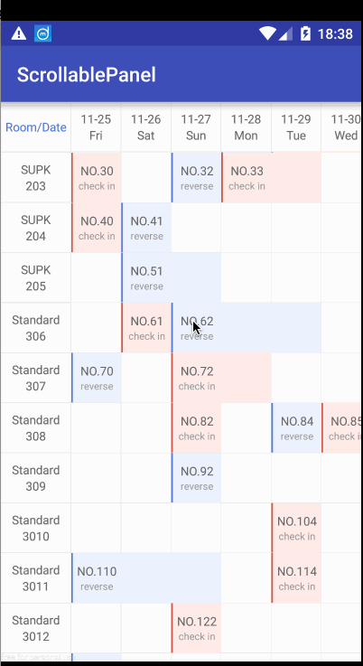

# ScrollablePanel
---

A flexible view for providing a limited rect window into a large data set,just like a two-dimensional RecyclerView.

It different from RecyclerView is that it's two-dimensional(just like a Panel) and it pin the itemView of first row and first column in their original location.

 

## Demo ##

Apk Download:[ScrollablePanelDemo.apk](art/ScrollablePanelDemo.apk) 

## Download ##

```groovy
  compile 'com.kelin.scrollablepanel:library:1.2.0' 
```

## Usage ##
ScrollablePanel is very similar to the RecyclerView and we can use them in the same way.

####1、Initialize ScrollablePanel
```xml
<com.kelin.scrollablepanel.library.ScrollablePanel
        android:id="@+id/scrollable_panel"
        android:layout_width="match_parent"
        android:layout_height="match_parent" />
```

####2、Adapter

This adapter must extend a class called PanelAdapter,We now have to override following methods so that we can implement our logic.
```java 
public class TestPanelAdapter extends PanelAdapter {
    private List<List<String>> data;

    @Override
    public int getRowCount() {
        return data.size();
    }

    @Override
    public int getColumnCount() {
        return data.get(0).size();
    }

    @Override
    public int getItemViewType(int row, int column) {
        return super.getItemViewType(row, column);
    }

    @Override
    public void onBindViewHolder(RecyclerView.ViewHolder holder, int row, int column) {
        String title = data.get(row).get(column);
        TitleViewHolder titleViewHolder = (TitleViewHolder) holder;
        titleViewHolder.titleTextView.setText(title);
    }

    @Override
    public RecyclerView.ViewHolder onCreateViewHolder(ViewGroup parent, int viewType) {
        return new TestPanelAdapter.TitleViewHolder(LayoutInflater.from(parent.getContext())
                .inflate(R.layout.listitem_title, parent, false));
    }

    private static class TitleViewHolder extends RecyclerView.ViewHolder {
        public TextView titleTextView;

        public TitleViewHolder(View view) {
            super(view);
            this.titleTextView = (TextView) view.findViewById(R.id.title);
        }
    }
}
```
####3、Set Adapter
```java
@Override
protected void onCreate(Bundle savedInstanceState) {
   ...
   ...
   TestPanelAdapter testPanelAdapter = new TestPanelAdapter();
   ScrollablePanel scrollablePanel = (ScrollablePanel) findViewById(R.id.scrollable_panel);
   scrollablePanel.setPanelAdapter(testPanelAdapter);
   ...
   ...
}
 ```
## ChangeLog ##

-  V1.0.1 (2016-12-01) fix header scroll bug
-  V1.1.0 (2016-12-21) fix desynchronisation between RV’s & fix dislocation of first column in every row!
-  V1.2.0 (2016-12-26)  Add notifyDataSetChanged  & Fix auto reset to original position when first time scroll down!

## License
   ```
    Copyright 2016 Kelin Hong
    
    Licensed under the Apache License, Version 2.0 (the "License");
    you may not use this file except in compliance with the License.
    You may obtain a copy of the License at
    
       http://www.apache.org/licenses/LICENSE-2.0
    
    Unless required by applicable law or agreed to in writing, software
    distributed under the License is distributed on an "AS IS" BASIS,
    WITHOUT WARRANTIES OR CONDITIONS OF ANY KIND, either express or implied.
    See the License for the specific language governing permissions and
    limitations under the License.
    
   ```